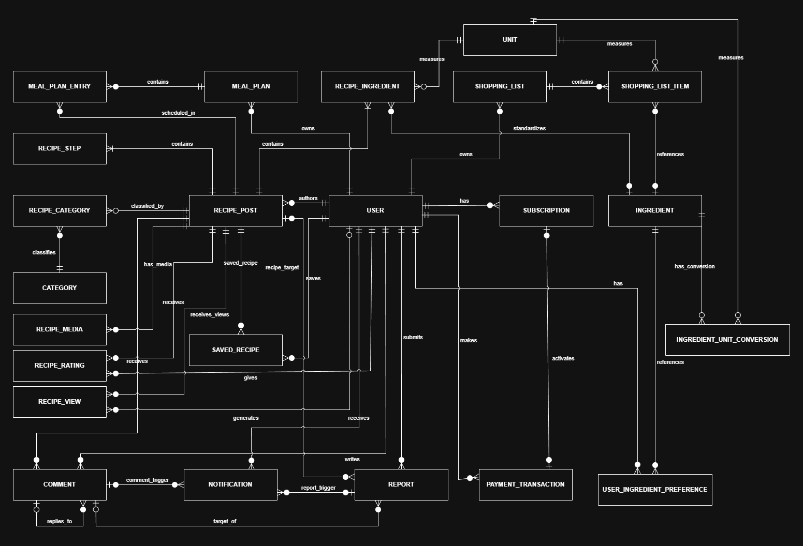

> **Document:** ERD Workspace Guide  
> **File:** `docs/diagrams/ERD/README.md`  
> **Version:** v1.4.0  
> **Created:** 2026-06-14  
> **Last Updated:** 2026-09-18  
> **Status:** Active  
> **Related Docs:** `docs/architecture/ARCHITECTURE.md`, `docs/requirements/SRS.md`, `database/README.md`

# ERD Workspace Guide — Hướng Dẫn Sơ Đồ Quan Hệ Thực Thể

## 1. Mục Đích và Tác Dụng của Sơ Đồ ERD

`ERD` (Entity Relationship Diagram — Sơ đồ quan hệ thực thể) trong thư mục này là mô hình dữ liệu cấp cao ở mức **Khái niệm (Conceptual Level)** của hệ thống **Mâm Xanh (Vegetarian Support System)**. 

Trong quy trình phát triển phần mềm của dự án, sơ đồ này có các tác dụng cốt lõi sau:

1. **Định hình bức tranh tổng thể về dữ liệu nghiệp vụ:**
   * Giúp toàn bộ 5 thành viên trong nhóm phát triển, giảng viên và các bên liên quan có cùng một góc nhìn thống nhất về các đối tượng dữ liệu mà hệ thống cần quản trị và vận hành.
2. **Xác lập và bảo vệ ranh giới phạm vi dữ liệu MVP:**
   * Khóa chặt phạm vi mô hình dữ liệu ở đúng **23 thực thể cốt lõi** đã được phê duyệt.
   * Ngăn ngừa tình trạng phình to phạm vi (scope creep) hoặc việc các thành viên tự tiện phát sinh bảng mới ngoài các quyết định kiến trúc đã chốt.
3. **Làm cầu nối giữa Yêu cầu nghiệp vụ (SRS) và Thiết kế kỹ thuật (Database Design):**
   * Chuyển hóa các yêu cầu chức năng (FR) và quy tắc nghiệp vụ (BR) từ tài liệu đặc tả thành các khái niệm thực thể dữ liệu rõ ràng trước khi bước vào lập trình chi tiết.
   * Là cơ sở định hướng để xây dựng mô hình dữ liệu vật lý (Physical Data Model), thiết kế khóa chính (PK), khóa ngoại (FK), các chỉ mục (Indexes) và ràng buộc toàn vẹn dữ liệu.
4. **Định hướng triển khai mã nguồn Backend và Migration:**
   * Làm kim chỉ nam cho các thành viên phụ trách Backend khi thiết kế các lớp Entity trong Java/Spring Data JPA và viết các kịch bản chuyển đổi dữ liệu (Flyway migration scripts).
   * Là căn cứ đối chiếu để duy trì ảnh chụp lược đồ cơ sở dữ liệu trong [database/schema.sql](../../../database/schema.sql).
5. **Giảm thiểu rủi ro thiết kế cơ sở dữ liệu:**
   * Giúp phát hiện sớm các điểm thiếu sót về cấu trúc thông tin ngay từ giai đoạn thiết kế kiến trúc, hạn chế tối đa việc phải tái cấu trúc cơ sở dữ liệu lớn khi hệ thống đã đi vào giai đoạn viết code.

---

## 2. Hình Ảnh và Tệp Nguồn Sơ Đồ

Dưới đây là sơ đồ quan hệ thực thể mức khái niệm đã được chốt hoàn chỉnh của hệ thống Mâm Xanh:

* File nguồn Draw.io có thể mở và chỉnh sửa trực tiếp: [conceptual-erd-v1.0.0.drawio](./conceptual-erd-v1.0.0.drawio)
* Để xem trực quan cấu trúc sơ đồ, các thành viên có thể mở file ảnh PNG trên hoặc mở file `.drawio` bằng công cụ [Draw.io](https://app.diagrams.net/) hoặc extension Draw.io trên VS Code / IDE.
* *Lưu ý quy trình:* Thiết kế vật lý và phân rã cơ sở dữ liệu do lập trình viên phụ trách triển khai; tác vụ tài liệu bảo toàn ranh giới khái niệm mà không tự ý sửa đổi file sơ đồ vẽ.

---

## 3. Ranh Giới 23 Thực Thể Khái Niệm Cốt Lõi (Conceptual Baseline)

Căn cứ theo quyết định kiến trúc cập nhật ngày 18/09/2026, mô hình dữ liệu của MVP bao gồm chính xác **23 thực thể cốt lõi**:

| # | Thực thể (Entity) | Vai trò khái niệm trong hệ thống |
|---|---|---|
| 1 | **User** | Quản lý thông tin tài khoản, hồ sơ cá nhân và chỉ số dinh dưỡng/thể trạng (đã gộp từ `User Profile`). |
| 2 | **User Ingredient Preference** | Lưu trữ sở thích, kiêng kỵ và dị ứng nguyên liệu của người dùng (`ALLERGY`, `AVOID`, `DISLIKE`). |
| 3 | **Recipe Post** | Bài viết công thức nấu ăn chay (chứa thông tin cấu trúc, tác giả, khẩu phần, thời gian, loại ăn chay, 0..1 link YouTube, và liên kết đến các bước, media, rating, view). |
| 4 | **Category** | Danh mục bài viết / món ăn do Administrator quản trị. |
| 5 | **Recipe Category** | Thực thể liên kết nhiều–nhiều (N:M) giữa bài công thức và danh mục. |
| 6 | **Ingredient** | Từ điển nguyên liệu chuẩn (tên, calo và dinh dưỡng tham khảo). |
| 7 | **Recipe Ingredient** | Nguyên liệu cụ thể trong một bài công thức kèm theo định lượng số dương và đơn vị đo. |
| 8 | **Saved Recipe** | Thực thể đánh dấu lưu lại các bài công thức yêu thích của Member (Bookmark). |
| 9 | **Comment** | Bình luận và phản hồi trên bài viết công thức. |
| 10 | **Report** | Báo cáo vi phạm nội dung từ người dùng, tích hợp trực tiếp kết quả và lý do xử lý của Admin (đã gộp từ `Moderation Action`). |
| 11 | **Meal Plan** | Kế hoạch thực đơn bữa ăn theo tuần (7 ngày) của người dùng. |
| 12 | **Meal Plan Entry** | Món ăn cụ thể được phân bổ vào từng ngày và từng bữa (Sáng, Trưa, Tối). |
| 13 | **Shopping List** | Danh sách mua sắm nguyên liệu (tạo từ thực đơn, bài công thức hoặc lập thủ công). |
| 14 | **Shopping List Item** | Từng mục nguyên liệu cần mua kèm số lượng, đơn vị và trạng thái đã mua (`is_bought`). |
| 15 | **Subscription** | Quản lý gói dịch vụ hội viên (FREE, PLUS, PRO), thời hạn hiệu lực và phân tầng tính năng AI. |
| 16 | **Payment Transaction** | Lịch sử giao dịch thanh toán trực tuyến qua payOS để kích hoạt gói dịch vụ. |
| 17 | **Notification** | Thông báo trong ứng dụng gửi tới người dùng. |
| 18 | **Recipe Step** (`RECIPE_STEP`) | Quản lý 1–30 bước hướng dẫn chuẩn bị/chế biến tuần tự (`step_order` 1..N, nội dung 10–2.000 ký tự). |
| 19 | **Recipe Media** (`RECIPE_MEDIA`) | Quản lý 0–5 hình ảnh minh họa bài công thức trên Azure Blob Storage, thứ tự hiển thị và cờ ảnh đại diện (`is_cover`). |
| 20 | **Recipe Rating** (`RECIPE_RATING`) | Quản lý đánh giá 1–5 sao của Member đối với bài công thức (1 đánh giá/user/recipe, updatable, tác giả không tự chấm). |
| 21 | **Recipe View** (`RECIPE_VIEW`) | Ghi nhận sự kiện xem bài viết phục vụ khử trùng lặp cửa sổ 30 phút và tổng hợp thống kê 24h, 7d, 30d, all-time. |
| 22 | **Unit** (`UNIT`) | Từ điển đơn vị đo lường chuẩn hóa thuộc các chiều `MASS` (g, kg), `VOLUME` (ml, L), `COUNT` (quả, củ, bìa...). |
| 23 | **Ingredient Unit Conversion** (`INGREDIENT_UNIT_CONVERSION`) | Bảng quy tắc quy đổi giữa các đơn vị đặc thù (quả, củ, bìa, ml...) sang gram cho từng nguyên liệu cụ thể để tính dinh dưỡng. |

### Các thành phần đã loại bỏ hoặc sáp nhập để tối ưu hóa phạm vi MVP:
* ❌ **`recipe_like` & `comment_like`**: Loại bỏ hoàn toàn tương tác Thích/Bỏ thích trên toàn hệ thống.
* ❌ **`moderation_action`**: Loại bỏ bảng riêng; kết quả và lý do kiểm duyệt lưu trực tiếp trên `Report`.
* ❌ **`user_profile`**: Gộp trực tiếp vào thực thể `User`.
* ❌ **`ai_usage_record`**: Loại bỏ bảng đếm lượt; phân quyền AI theo gói `Subscription` và đo lường kỹ thuật qua log hạ tầng.
* ❌ **`trending_recipe`**: Loại bỏ bảng lưu trữ trending tĩnh; bảng xếp hạng xu hướng và hoạt động sôi nổi được tính toán động qua công thức giải tích (BR-71, BR-72).

---

## 3.1 Ma Trận Quan Hệ và Bản Số (Relationship & Cardinality Matrix)

Dưới đây là đặc tả chi tiết toàn bộ **37 mối quan hệ nghiệp vụ** được mô hình hóa trong sơ đồ `conceptual-erd-v1.0.0.drawio`:

| STT | Thực thể nguồn (Source) | Bản số nguồn | Động từ / Tên quan hệ | Thực thể đích (Target) | Bản số đích | Ý nghĩa nghiệp vụ & Ràng buộc toàn vẹn |
|---|---|---|---|---|---|---|
| 1 | `USER` | 1 | `authors` | `RECIPE_POST` | 0..* | Một người dùng có thể tạo 0 hoặc nhiều bài công thức; mỗi bài công thức bắt buộc thuộc về đúng 1 tác giả (`USER`). |
| 2 | `USER` | 1 | `has` | `USER_INGREDIENT_PREFERENCE` | 0..* | Một người dùng có thể có 0 hoặc nhiều sở thích/kiêng kỵ nguyên liệu. |
| 3 | `USER` | 1 | `saves` | `SAVED_RECIPE` | 0..* | Một người dùng có thể lưu lại (bookmark) 0 hoặc nhiều bài công thức yêu thích. |
| 4 | `USER` | 1 | `writes` | `COMMENT` | 0..* | Một người dùng có thể viết 0 hoặc nhiều bình luận/phản hồi. |
| 5 | `USER` | 1 | `submits` | `REPORT` | 0..* | Một người dùng có thể gửi 0 hoặc nhiều báo cáo vi phạm. |
| 6 | `USER` | 1 | `owns` | `MEAL_PLAN` | 0..* | Một người dùng có thể sở hữu 0 hoặc nhiều kế hoạch thực đơn tuần. |
| 7 | `USER` | 1 | `owns` | `SHOPPING_LIST` | 0..* | Một người dùng có thể sở hữu 0 hoặc nhiều danh sách đi chợ. |
| 8 | `USER` | 1 | `has` | `SUBSCRIPTION` | 0..* | Một người dùng sở hữu lịch sử các gói đăng ký hội viên (FREE, PLUS, PRO). |
| 9 | `USER` | 1 | `makes` | `PAYMENT_TRANSACTION` | 0..* | Một người dùng thực hiện 0 hoặc nhiều giao dịch thanh toán trực tuyến qua payOS. |
| 10 | `USER` | 1 | `receives` | `NOTIFICATION` | 0..* | Một người dùng nhận 0 hoặc nhiều thông báo in-app. |
| 11 | `USER` | 1 | `gives` | `RECIPE_RATING` | 0..* | Một Member cho điểm đánh giá bài viết (1–5 sao; tối đa 1 đánh giá/bài, tác giả không tự đánh giá bài mình). |
| 12 | `USER` | 0..1 | `generates` | `RECIPE_VIEW` | 0..* | Một lượt xem có thể sinh ra từ Member đã đăng nhập (`1`) hoặc Guest vô danh (`0..1`, định danh qua IP hash / Client session). |
| 13 | `RECIPE_POST` | 1 | `contains` | `RECIPE_STEP` | 1..* | **Bắt buộc 1..* :** Mỗi bài công thức bắt buộc phải có từ 1 đến 30 bước thực hiện tuần tự (`RECIPE_STEP`, `BR-19`). |
| 14 | `RECIPE_POST` | 1 | `has_media` | `RECIPE_MEDIA` | 0..* | Mỗi bài công thức chứa từ 0 đến 5 hình ảnh minh họa trên Azure Blob Storage (`BR-20`), đúng 1 ảnh đại diện (`is_cover = true`). |
| 15 | `RECIPE_POST` | 1 | `contains` | `RECIPE_INGREDIENT` | 1..* | **Bắt buộc 1..* :** Mỗi bài công thức bắt buộc phải có từ 1 đến 50 dòng nguyên liệu định lượng. |
| 16 | `RECIPE_POST` | 1 | `classified_by` | `RECIPE_CATEGORY` | 0..* | Liên kết N:M phân loại bài công thức vào các danh mục. |
| 17 | `RECIPE_POST` | 1 | `receives` | `RECIPE_RATING` | 0..* | Một bài công thức nhận 0 hoặc nhiều lượt đánh giá sao từ cộng đồng Member (`FR-57`). |
| 18 | `RECIPE_POST` | 1 | `receives_views` | `RECIPE_VIEW` | 0..* | Một bài công thức nhận các sự kiện xem phục vụ thống kê 24h/7d/30d/toàn thời gian (`FR-58`). |
| 19 | `RECIPE_POST` | 1 | `saved_recipe` | `SAVED_RECIPE` | 0..* | Một bài công thức có thể được lưu bởi nhiều người dùng. |
| 20 | `RECIPE_POST` | 1 | `receives` | `COMMENT` | 0..* | Một bài công thức nhận các bình luận từ cộng đồng. |
| 21 | `RECIPE_POST` | 0..1 | `recipe_target` | `REPORT` | 0..* | Báo cáo vi phạm nhắm mục tiêu vào bài viết công thức (nếu đối tượng bị báo cáo là bài viết). |
| 22 | `RECIPE_POST` | 1 | `scheduled_in` | `MEAL_PLAN_ENTRY` | 0..* | Một bài công thức được đưa vào các bữa ăn trong kế hoạch thực đơn. |
| 23 | `CATEGORY` | 1 | `classifies` | `RECIPE_CATEGORY` | 0..* | Một danh mục chứa 0 hoặc nhiều bài công thức. |
| 24 | `INGREDIENT` | 0..1 | `standardizes` | `RECIPE_INGREDIENT` | 0..* | **Linh hoạt 0..1 :** Dòng nguyên liệu trong bài có thể liên kết với nguyên liệu chuẩn (`1`) hoặc là tên tự do tác giả nhập (`0..1`, SRS 3.4). |
| 25 | `RECIPE_INGREDIENT` | 0..* | `measures` | `UNIT` | 1 | **Bắt buộc 1 :** Mọi dòng nguyên liệu bắt buộc phải chọn 1 đơn vị đo chuẩn thuộc `UNIT` (`BR-73`). |
| 26 | `INGREDIENT` | 1 | `references` | `USER_INGREDIENT_PREFERENCE` | 0..* | Sở thích/kiêng kỵ của người dùng liên kết trực tiếp tới nguyên liệu chuẩn. |
| 27 | `INGREDIENT` | 0..1 | `references` | `SHOPPING_LIST_ITEM` | 0..* | Mục cần mua trong danh sách đi chợ có thể tham chiếu nguyên liệu chuẩn hoặc nhập tự do. |
| 28 | `SHOPPING_LIST_ITEM` | 0..* | `measures` | `UNIT` | 1 | Mọi mục cần mua trong danh sách đi chợ bắt buộc có đơn vị đo chuẩn hóa. |
| 29 | `INGREDIENT_UNIT_CONVERSION` | 0..* | `has_conversion` | `INGREDIENT` | 1 | Bảng quy đổi thuộc về 1 nguyên liệu cụ thể để quy đổi đơn vị đặc thù (quả, củ, bìa, ml...) sang gram. |
| 30 | `INGREDIENT_UNIT_CONVERSION` | 0..* | `measures` | `UNIT` | 1 | Đơn vị nguồn trong bảng quy đổi tham chiếu đến từ điển `UNIT`. |
| 31 | `COMMENT` | 0..1 | `replies_to` | `COMMENT` | 0..* | **Quan hệ đệ quy (Self-reference):** Hỗ trợ cây phản hồi lồng nhau tối đa 5 cấp; bình luận gốc có `parent_id = NULL`. |
| 32 | `COMMENT` | 0..1 | `comment_trigger` | `NOTIFICATION` | 0..* | Bình luận hoặc phản hồi mới kích hoạt thông báo gửi đến tác giả hoặc người được reply. |
| 33 | `REPORT` | 0..* | `target_of` | `COMMENT` | 0..1 | Báo cáo vi phạm nhắm mục tiêu vào 1 bình luận (nếu đối tượng bị báo cáo là bình luận). |
| 34 | `REPORT` | 0..1 | `report_trigger` | `NOTIFICATION` | 0..* | Kết quả xử lý báo cáo kích hoạt thông báo phản hồi cho người dùng. |
| 35 | `MEAL_PLAN` | 1 | `contains` | `MEAL_PLAN_ENTRY` | 0..* | Kế hoạch thực đơn tuần chứa các bữa ăn (Sáng, Trưa, Tối) trong từng ngày. |
| 36 | `SHOPPING_LIST` | 1 | `contains` | `SHOPPING_LIST_ITEM` | 0..* | Danh sách đi chợ chứa các mục nguyên liệu cần mua. |
| 37 | `PAYMENT_TRANSACTION` | 0..1 | `activates` | `SUBSCRIPTION` | 0..1 | Giao dịch thanh toán thành công kích hoạt hoặc gia hạn đúng 1 gói dịch vụ tương ứng. |

---

## 3.2 Điểm Nhấn Kiến Trúc Dữ Liệu Khái Niệm

1. **Tính độc lập giữa Khái niệm và Triển khai vật lý:**
   * Bản vẽ ERD thể hiện sự tường minh về ngữ nghĩa nghiệp vụ. Việc chuyển đổi từ mức Khái niệm sang mức Lược đồ Cơ sở dữ liệu vật lý (Physical Schema) sẽ do kỹ sư cơ sở dữ liệu quyết định (như kiểu dữ liệu `BIGINT`/`INT`, khóa ngoại tổng hợp, chỉ mục `INDEX` và `FOREIGN KEY` constraints).
2. **Hỗ trợ Người dùng Vãng lai (Guest) không phá vỡ mô hình:**
   * Quan hệ `USER` (0..1) $\rightarrow$ `RECIPE_VIEW` (0..*) cho phép ghi nhận lượt xem từ Guest mà không cần tạo bản ghi "ảo" trong bảng `USER`. Định danh Guest được xử lý qua chuỗi băm IP + Client Session Hash.
3. **Cơ chế Nhập Nguyên liệu Linh hoạt (Flexible Ingredients):**
   * Quan hệ `INGREDIENT` (0..1) $\rightarrow$ `RECIPE_INGREDIENT` (0..*) bảo đảm người đăng có thể dùng tên nguyên liệu mới chưa có trong từ điển mà không bị chặn đăng bài, đúng theo quyết định SRS 3.4.
4. **Cổng Kiểm Định Xuất Bản (Publish Gate):**
   * Sự kết hợp giữa `RECIPE_INGREDIENT`, `UNIT` và `INGREDIENT_UNIT_CONVERSION` bảo đảm mọi bài công thức công khai đều có khả năng quy đổi sang gram để phục vụ tính toán dinh dưỡng chính xác.
5. **Cấu trúc Báo cáo Đa hình (Polymorphic Target):**
   * Thực thể `REPORT` có quan hệ tùy chọn `0..1` với cả `RECIPE_POST` và `COMMENT`, cho phép một bảng duy nhất xử lý báo cáo cho cả hai loại nội dung vi phạm mà không cần tạo các bảng báo cáo riêng biệt.

---

## 4. Mối Liên Hệ Với Triển Khai Cơ Sở Dữ Liệu (Database Implementation)

Sơ đồ ERD trong thư mục này dừng ở mức **Khái niệm (Conceptual)** để xác lập thực thể và ranh giới nghiệp vụ. Khi chuyển sang giai đoạn phát triển:

1. **Thiết kế Lược đồ Chi tiết (Physical Schema):**
   * Các bảng vật lý, kiểu dữ liệu cụ thể (`BIGINT`, `NVARCHAR`, `VARCHAR`, `DATETIME2`), chỉ mục (Indexes) và ràng buộc khóa ngoại (Foreign Keys) sẽ được đặc tả chi tiết trong tài liệu thiết kế cơ sở dữ liệu và hiện thực hóa trong [database/schema.sql](../../../database/schema.sql).
2. **Quản lý Phiên bản Cơ sở dữ liệu bằng Flyway:**
   * Mọi thay đổi cấu trúc bảng trong quá trình lập trình Backend phải được tạo thành các file migration tuần tự trong thư mục `app/mamxanh-backend/src/main/resources/db/migration/` (theo chuẩn `V1__...`, `V2__...`).
   * Tuyệt đối không chỉnh sửa trực tiếp database trên môi trường triển khai mà không qua migration scripts.

---

## 5. Quy Ước Đặt Tên và Quản Lý Tệp

* **Vị trí thư mục:** `docs/diagrams/ERD/`
* **File sơ đồ Draw.io gốc:** `conceptual-erd-v[version].drawio` (Ví dụ: `conceptual-erd-v1.0.0.drawio`)
* **File hình ảnh xuất ra:** `conceptual-erd-v[version].drawio.png` (Ví dụ: `conceptual-erd-v1.0.0.drawio.png`)
* **Quy trình cập nhật:** Khi có điều chỉnh về danh mục thực thể theo quyết định kiến trúc mới, cần cập nhật file Draw.io, xuất lại ảnh PNG tương ứng, và cập nhật số phiên bản trong file `README.md` này.
