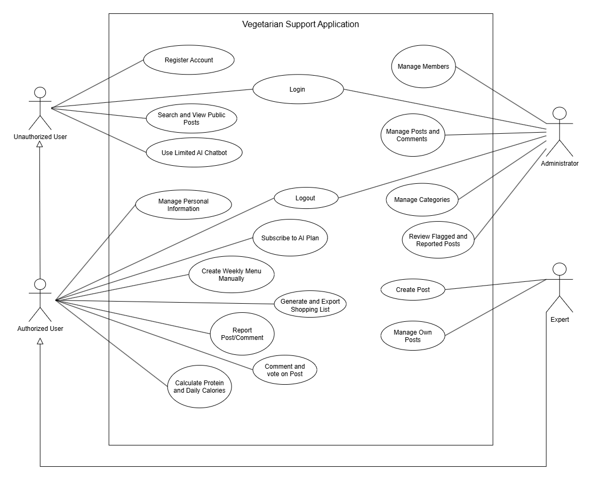

> **Document:** Use Case Diagram Workspace Guide  
> **File:** `docs/diagrams/UseCase/README.md`  
> **Version:** v1.3.0
> **Created:** 2026-06-14  
> **Last Updated:** 2026-09-27
> **Status:** Active  

# Use Case Diagram - Sơ Đồ Ca Sử Dụng

## Mục Đích

`Use Case Diagram` (Sơ đồ ca sử dụng) là sơ đồ mô tả mối quan hệ tương tác giữa những đối tượng bên ngoài (Actor) và các chức năng (Use Case) bên trong hệ thống. Sơ đồ này giúp:
* Minh họa những actor nào tương tác với các capability đã được yêu cầu hiện hành xác nhận.
* Khái quát hóa các actor-goal Use Case để hỗ trợ trao đổi và review thiết kế.
* Minh họa ranh giới hệ thống (System Boundary) mà không thay thế SRS.

Sơ đồ là supporting visualization. Root SRS và các tài liệu FR/BR/NFR được đăng ký mới là nguồn định nghĩa requirement; khi sơ đồ khác requirement, phải sửa sơ đồ chứ không suy ngược requirement từ sơ đồ.

## Sơ Đồ Ca Sử Dụng Tổng Thể (System Use Case Diagram)

Dưới đây là sơ đồ tổng quan hiện có. Trong baseline hiện hành, **Guest** là actor chưa xác thực; **Member** là lớp actor đã xác thực gồm hai business role `CUSTOMER` và `EXPERT`; **Administrator** tương ứng `ADMIN`. `EXPERT` có quyền riêng về tạo/sửa/xóa Recipe Post. Tệp hình hiện cần một vòng cập nhật supporting artifact để thể hiện mapping này nhất quán và sửa các nhãn cũ; nó không được dùng để thay đổi requirement.



* Tệp nguồn Draw.io có thể mở và chỉnh sửa trực tiếp: [usecase-vegetarian-support-application.drawio](./usecase-vegetarian-support-application.drawio)
* Các thành viên có thể mở trực tiếp bằng extension Draw.io trên VS Code hoặc tại [Draw.io](https://app.diagrams.net/).

---

## Thành Phần Cơ Bản

* **Actor (Tác nhân):** Là người dùng hoặc hệ thống bên ngoài tương tác trực tiếp với ứng dụng (ví dụ: Guest, Member, Administrator).
* **Use Case (Ca sử dụng):** Một chức năng cụ thể mà actor có thể thực hiện trên hệ thống để đạt được một mục tiêu nào đó (ví dụ: Đăng ký/Đăng nhập, Khám phá công thức, Bình chọn Like/Dislike, Lập thực đơn).
* **System Boundary (Ranh giới hệ thống):** Khung giới hạn hiển thị phạm vi của ứng dụng, các use case sẽ nằm bên trong và các actor nằm bên ngoài ranh giới này.
* **Include (Quan hệ bao gồm):** Thể hiện một use case bắt buộc phải chạy qua một use case khác (ví dụ: Đăng bài công thức thì *bao gồm* việc xác thực đăng nhập Member).
* **Extend (Quan hệ mở rộng):** Thể hiện một use case phụ chỉ xảy ra dưới một điều kiện cụ thể (ví dụ: Soạn bài viết thì có thể chọn *mở rộng* thêm là Sử dụng AI gợi ý các bước nấu).

## Quy Tắc Đặt Tên File

Các file sơ đồ Use Case được đặt tên phân loại theo module hoặc sơ đồ tổng thể:
```text
usecase-[ten-module-viet-lien-khong-dau].drawio
usecase-[ten-module-viet-lien-khong-dau].png
```

Ví dụ cụ thể:
* `usecase-vegetarian-support-application.drawio` (sơ đồ Use Case tổng thể toàn hệ thống)
* `usecase-auth.drawio` (sơ đồ Use Case phân quyền & đăng nhập)
* `usecase-meal-planner.png` (sơ đồ Use Case chức năng lập lịch ăn)

---

## Mẫu Mô Tả Use Case

Dưới đây là mẫu tài liệu hóa chi tiết cho từng ca sử dụng:

### UC-01: Thêm công thức vào lịch ăn

| Mục | Nội dung |
|---|---|
| **Actor** | Member |
| **Mục tiêu** | Thêm một bài công thức công khai vào ngày và bữa đã chọn |
| **Tiền điều kiện** | Member đã đăng nhập; bài công thức còn công khai |
| **Hậu điều kiện** | Mục lịch ăn được lưu đúng ngày/bữa và truy vết được tới Member/công thức |

**Luồng xử lý chính (Main Flow):**
1. Member chọn công thức, ngày và loại bữa.
2. Member xác nhận thao tác.
3. Hệ thống kiểm tra quyền, dữ liệu hợp lệ và quy tắc chống trùng.
4. Hệ thống lưu mục lịch ăn và hiển thị kết quả.

**Luồng thay thế (Alternative Flow):**
1. Nếu công thức đã tồn tại trong cùng ngày/bữa, hệ thống từ chối và giữ dữ liệu cũ.
2. Nếu phiên hết hạn hoặc bài đã bị ẩn, hệ thống báo đúng trạng thái và không tạo mục lịch.
